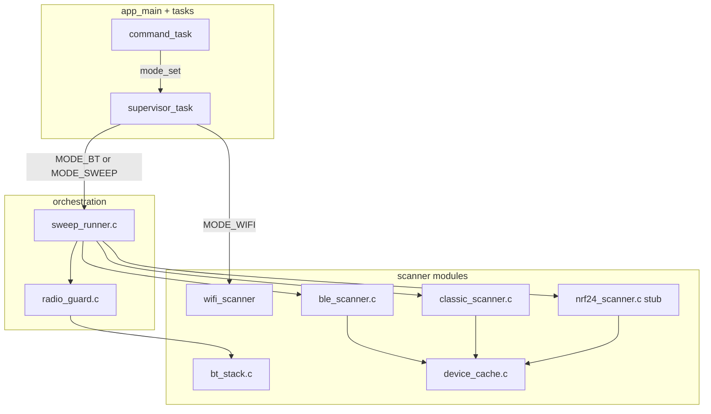

# Classic + BLE Scanner Implementation Plan

## Goals

- Replace the [`bt_scanner_run()` placeholder](scanner-standalone/main/main.c) with real **GAP-only** discovery (no GATT, no SDP, no pairing).
- Match existing modularity: each radio feature is a **small module** with `init` / `run` / `shutdown`, like [`wifi_scanner.c`](scanner-standalone/main/wifi_scanner.c) (driver brought up only while its mode is active).
- Enforce **never Wi-Fi scan + BT scan concurrently** (your constraint) and **one internal 2.4 GHz stack active at a time** during BT work (your sweep spec).
- Prepare for Bruce/ESP-DIV-style growth: optional hardware in [`board_config.h`](scanner-standalone/main/board_config.h), `sweep_all` orchestrator, shared [`device_record`](scanner-standalone/main/device_record.h) for later ESP-NOW.

## Architecture



**Supervisor rule:** only one of `wifi_scanner_run()`, `bt_scanner_run()`, or `sweep_runner_run()` executes at a time. Switching modes always runs a **radio guard** that stops the previous radio and frees heap before starting the next.

## Mode and command model

Extend [`scanner_types.h`](scanner-standalone/main/scanner_types.h):

| Mode | Meaning |
|------|---------|
| `MODE_IDLE` | No scanner |
| `MODE_WIFI` | Wi-Fi AP scan (unchanged) |
| `MODE_BT` | BLE-only session (10 s default), full stack teardown after |
| `MODE_BT_CLASSIC` | Classic inquiry session (~11 s), full teardown after |
| `MODE_SWEEP` | Sequential macro: BLE → pause → Classic → pause → nRF (if present) |

Serial commands in [`main.c`](scanner-standalone/main/main.c) (keep README in sync):

| Command | Action |
|---------|--------|
| `wifi` | `MODE_WIFI` (existing) |
| `bt-ble` | `MODE_BT` — BLE phase only |
| `bt-classic` | `MODE_BT_CLASSIC` — Classic phase only |
| `bt` | Alias: run **both** sequentially (same as `sweep_bt` below, no nRF) |
| `sweep_all` | `MODE_SWEEP` — full macro per your spec |
| `stop` | `MODE_IDLE` + `radio_guard_all_off()` |

`bt` exists for backward compatibility with the current README; implementation delegates to a shared `sweep_run_bt_only()` used by `bt` and the first two phases of `sweep_all`.

## Module breakdown (new files)

### 1. [`board_config.h`](scanner-standalone/main/board_config.h) (new)

- DOIT DevKit LED: GPIO 2 (from existing `main.c`).
- Optional **nRF24L01** SPI pins (default `GPIO_NUM_NC`, `NRF24L01_PRESENT false`).
- Document that pins must be filled before enabling nRF on a custom shield.

### 2. [`device_record.h`](scanner-standalone/main/device_record.h) + [`device_cache.c`](scanner-standalone/main/device_cache.c)

Structured discovery record (panel-ready, no ASCII table formatting on device):

- `radio`: `SCAN_RADIO_BLE` | `SCAN_RADIO_CLASSIC` | `SCAN_RADIO_NRF24` (future)
- `addr[6]`, `addr_type`, `rssi`, `name[32]` (+ len), `cod` (Classic), `appearance` (BLE), `mfg_company_id` + small `mfg_data[8]`, `last_seen_ms`
- Optional: raw adv length + 31-byte blob for BLE heuristics (Jieli/OUI later)

API: `device_cache_init()`, `device_cache_clear()`, `device_cache_upsert(const device_record_t *)`, `device_cache_foreach(callback)`, `device_cache_count()`.

Callbacks only **queue or update cache**; heavy logging in supervisor context after dequeue (same discipline as Espressif GAP docs: keep GAP callbacks thin).

### 3. [`radio_guard.c`](scanner-standalone/main/radio_guard.c)

Central **de-confliction** (your “one-radio-active” policy):

```c
void radio_guard_all_off(void);           /* idle: Wi-Fi driver down, BT controller down */
esp_err_t radio_guard_prepare_wifi(void); /* ensure BT fully off, then OK for wifi_scanner_run */
esp_err_t radio_guard_prepare_bt(void);   /* ensure Wi-Fi driver down (esp_wifi_deinit) */
void radio_guard_log_heap(const char *tag); /* ESP_LOGI free heap after transitions */
```

- Call `radio_guard_prepare_wifi()` at start of [`wifi_scanner_run()`](scanner-standalone/main/wifi_scanner.c) (defensive; today Wi-Fi already deinits on exit).
- Call `radio_guard_prepare_bt()` before any BT phase.
- After each phase: `bt_stack_shutdown()` + short `vTaskDelay(200–500 ms)` + `radio_guard_log_heap()`.
- **Never** call `esp_bt_controller_mem_release()` between BLE and Classic (irreversible on ESP32). Use `esp_bt_controller_disable()` + `esp_bluedroid_disable()` / `esp_bluedroid_deinit()` only ([bt_discovery walkthrough](https://github.com/espressif/esp-idf/tree/master/examples/bluetooth/bluedroid/classic_bt/bt_discovery)).

### 4. [`bt_stack.c`](scanner-standalone/main/bt_stack.c)

Thin Bluedroid lifecycle (BTDM):

- `bt_stack_init()` — `esp_bt_controller_init`, `esp_bt_controller_enable(ESP_BT_MODE_BTDM)`, `esp_bluedroid_init_with_cfg`, `esp_bluedroid_enable`, register **both** `esp_ble_gap_register_callback` and `esp_bt_gap_register_callback` once per session.
- `bt_stack_shutdown()` — reverse order; idempotent.
- `bt_stack_is_up()` — guard double init.

Headers: `esp_bt.h`, `esp_bt_main.h`, `esp_gap_ble_api.h`, `esp_gap_bt_api.h`.

### 5. [`ble_scanner.c`](scanner-standalone/main/ble_scanner.c)

Mirror IDF **gatt_client** scan flow ([walkthrough](https://github.com/espressif/esp-idf/blob/master/examples/bluetooth/bluedroid/ble/gatt_client/tutorial/Gatt_Client_Example_Walkthrough.md)):

- Active scan: `BLE_SCAN_TYPE_ACTIVE`, `scan_interval = scan_window = 0x50` (100% duty; good under coexist even though you won’t run with Wi-Fi scan).
- State machine in module: `set_scan_params` → on `ESP_GAP_BLE_SCAN_PARAM_SET_COMPLETE_EVT` → `esp_ble_gap_start_scanning(0)` until duration elapsed or `mode_get() != active_mode`.
- On `ESP_GAP_BLE_SCAN_RESULT_EVT` / `ESP_GAP_SEARCH_INQ_RES_EVT`: parse via `esp_ble_resolve_adv_data()` (name, flags, appearance, manufacturer, 16-bit UUID list) → `device_cache_upsert`.
- `ble_scanner_run(uint32_t duration_ms)` — blocking in supervisor; calls `esp_ble_gap_stop_scanning()` on exit.

### 6. [`classic_scanner.c`](scanner-standalone/main/classic_scanner.c)

Mirror **bt_discovery** ([example](https://github.com/espressif/esp-idf/tree/master/examples/bluetooth/bluedroid/classic_bt/bt_discovery)):

- `esp_bt_gap_start_discovery(ESP_BT_INQ_MODE_GENERAL_INQUIRY, inq_len, 0)` — `inq_len` chosen so duration ≈ **11 s** (units of 1.28 s; e.g. `inq_len = 9`).
- On `ESP_BT_GAP_DISC_RES_EVT`: read props `COD`, `RSSI`, `BDNAME`, `EIR`; if name empty, `esp_bt_gap_resolve_eir_data()` for name.
- Decode COD with `esp_bt_gap_get_cod_major_dev()` / `minor` / `srvc` helpers.
- On `ESP_BT_GAP_DISC_STATE_CHANGED_EVT` / stopped: return from `classic_scanner_run()`.
- **No** `esp_bt_gap_get_remote_services()` in v1 (SDP connects; defer to phase 2).
- **No** COD filter** (unlike the example’s phone/AV-only filter).

### 7. [`bt_scanner.c`](scanner-standalone/main/bt_scanner.c) + [`sweep_runner.c`](scanner-standalone/main/sweep_runner.c)

- `bt_scanner_run()` — `radio_guard_prepare_bt()` → `bt_stack_init()` → `device_cache_clear()` → `ble_scanner_run(10000)` → heap pause → `classic_scanner_run(11000)` → `bt_stack_shutdown()` → `device_cache_log_summary()` (compact serial lines for debug, not a UI table).
- `sweep_runner_run()` — same as above, then if `nrf_attached`: Phase 3 (stub).

### 8. [`nrf24_scanner.c`](scanner-standalone/main/nrf24_scanner.c) (scaffold)

Per your hardware-detection spec (no full 2.4 GHz sweep logic in this milestone unless time permits):

- `nrf24_probe_on_boot()` — if `board_config` pins valid: init SPI, read **CONFIG** register (`0x08`), expect default power-up pattern; set global `nrf_attached`.
- Log clearly: `NRF24: attached` / `not fitted`.
- Optional: second LED or distinct log prefix (no CrowPanel UI in this repo).
- `nrf24_scanner_run()` — stub: log “not implemented”, return `ESP_ERR_NOT_SUPPORTED` (hook for future Bruce-style module).

## Changes to existing files

| File | Change |
|------|--------|
| [`main/main.c`](scanner-standalone/main/main.c) | Remove inline `bt_scanner_run`; add commands; call `nrf24_probe_on_boot()` after GPIO init; supervisor handles `MODE_BT`, `MODE_BT_CLASSIC`, `MODE_SWEEP`; increase `supervisor` stack to **12–16 KB** (BT callbacks). |
| [`main/CMakeLists.txt`](scanner-standalone/main/CMakeLists.txt) | Add new `.c` files; `REQUIRES bt nvs_flash esp_timer` (drop hard dependency on `esp_wifi` only for wifi module — still required project-wide). |
| [`sdkconfig.defaults`](scanner-standalone/main/sdkconfig.defaults) (new at project root) | Pin reproducible BT: `CONFIG_BT_ENABLED`, Bluedroid, `CONFIG_BT_CLASSIC_ENABLED`, `CONFIG_BT_BLE_ENABLED`, BTDM dual mode, coexist enabled, Classic profiles off, optional `CONFIG_BT_BLE_ACT_SCAN_REP_ADV_SCAN`. Commit so CI/others match your menuconfig. |
| [`README.md`](scanner-standalone/README.md) | Document modules, commands, `sweep_all` phases, mutual exclusion, nRF probe, device record fields. |

## Boot sequence (updated)

```text
NVS → mode/event → LED → serial → esp_netif + event loop (no esp_wifi_init)
→ nrf24_probe_on_boot() → device_cache_init()
→ wifi_scanner_init() (event handler only)
→ cmd_task + supervisor_task
```

Wi-Fi driver still starts only inside `wifi_scanner_run()` (unchanged). BT controller starts only inside `bt_stack_init()` during BT/sweep modes.

## Testing plan

1. `idf.py set-target esp32 && idf.py build` with new `sdkconfig.defaults`.
2. `bt-ble` → serial shows BLE devices (name/MAC/RSSI); `stop` → idle, heap logged.
3. `bt-classic` → Classic devices with COD/name/RSSI; `stop`.
4. `bt` / `sweep_all` (no nRF) → both phases, cache count increases; no crash on heap.
5. `wifi` after `bt` → Wi-Fi scan works (radio guard tore down BT).
6. `bt` after `wifi` → BT works (Wi-Fi driver down).
7. With nRF pins left NC: boot log `nrf_attached=false`; `sweep_all` skips phase 3.

## Out of scope (explicit)

- ESP-NOW transmit, ASCII tables, SDP/service UUID fetch.
- Simultaneous Wi-Fi + BT scanning.
- Full nRF24 channel sweep (stub + probe only).
- CrowPanel UI (separate repo consumes structured records later).

## Implementation order

1. `board_config.h`, `device_record` + `device_cache`, `radio_guard`
2. `sdkconfig.defaults` + `bt_stack`
3. `ble_scanner` then `classic_scanner` (test each via `bt-ble` / `bt-classic`)
4. `bt_scanner` + `sweep_runner` + `main.c` commands
5. `nrf24_scanner` probe stub + README
